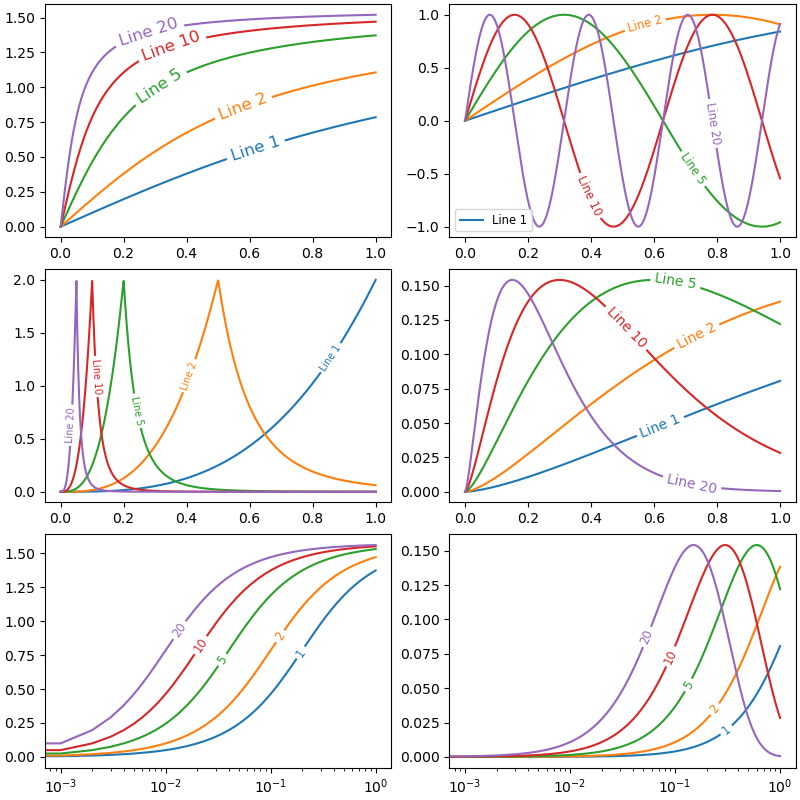

# matplotlib_inline_labels


This package is inspired by [matplotlib-label-lines](https://github.com/cphyc/matplotlib-label-lines)

```python
import numpy as np
from matplotlib import pyplot as plt
from scipy.stats import chi2, loglaplace
import sys
sys.path.append("../src/")
from inline_labels import add_inline_labels

X = np.linspace(0, 1, 500)
A = [1, 2, 5, 10, 20]
funcs = [np.arctan, np.sin, loglaplace(4).pdf, chi2(5).pdf]

# %% Examples
fig, axes = plt.subplots(ncols=2, nrows=3, constrained_layout=True, figsize=(8, 8))
axes = axes.flatten()

for a in A: axes[0].plot(X, np.arctan(a * X), label=f"Line {a}")
add_inline_labels(axes[0], with_overall_progress=True, fontsize="large")

for a in A:
    axes[1].plot(X, np.sin(a * X), label=f"Line {a}")
    axes[2].plot(X, loglaplace(4).pdf(a * X), label=f"Line {a}")
    axes[3].plot(X, chi2(5).pdf(a * X), label=f"Line {a}")
    axes[4].semilogx(X, np.arctan(5 * a * X), label=str(a))
    axes[5].semilogx(X, chi2(5).pdf(a * X), label=str(a))
add_inline_labels(axes[1], with_overall_progress=True, fontsize="x-small")
add_inline_labels(axes[2], with_overall_progress=True, fontsize="medium")
add_inline_labels(axes[3], with_overall_progress=True, fontsize="medium")
add_inline_labels(axes[4], with_overall_progress=True, fontsize="small")
add_inline_labels(axes[5], with_overall_progress=True, fontsize="small")

fig.show()
```



# TODO
[ ] Handle the case of axis lims or scale modification after adding inline labels
[ ] Create an option to search label's position keeping the label's bounding box sides intersecting the curve in their centers
[ ] Avoid Line2D labels to overlap non Line2D objects -> Needs to build geometries for other objects
[ ] Make it work for line with error bars
